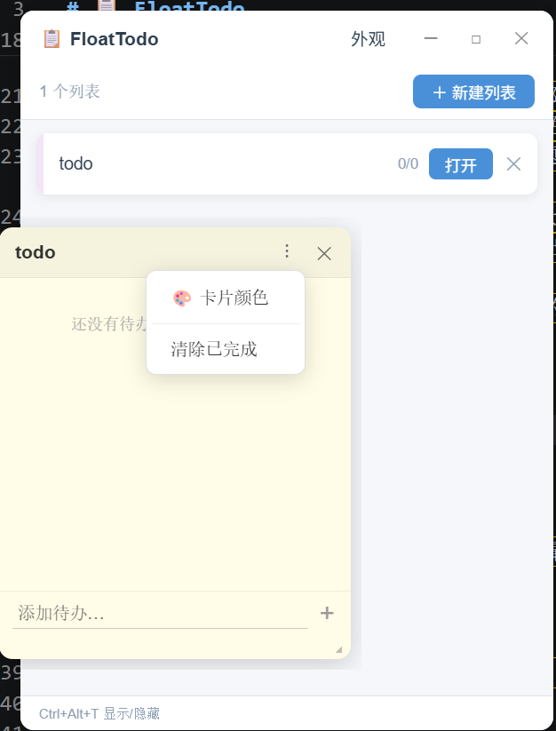

<div align="center">

# 📋 FloatTodo

**轻量级桌面悬浮便签 · Lightweight Floating Todo for Windows & Linux**

[](LICENSE)
[](https://tauri.app)
[](https://react.dev)
[](../../releases)

灵感来自 Snipaste —— 把待办清单像便签一样悬浮在桌面上，专注工作，不切换窗口。

</div>

---

## ✨ 特性

- 🪟 **多窗口悬浮** — 每个列表独立浮窗，常驻桌面最顶层，不遮挡工作
- ☑️ **圆形复选框** — 勾选后划线并移至底部，完成感满满
- 🎨 **三套主题** — 暖色纸感 / 亮色 / 深色，一键切换
- 🔤 **中英文字体分离** — 主菜单、便签标题、便签内容各自独立配置
- 🏷️ **双色系统** — 列表标签颜色与便签背景色完全独立
- ⌨️ **全局热键** — `Ctrl+Alt+T` 随时唤出，无需管理员权限
- 🚀 **开机自启** — 一键开启，托盘常驻
- 📦 **体积极小** — 基于 Tauri，安装包仅约 10 MB

## 📸 截图

> **

## 📥 下载安装

前往 [Releases](../../releases) 页面下载最新版：

**Windows**

| 文件 | 说明 |
|------|------|
| `FloatTodo_x.x.x_x64-setup.exe` | 推荐，NSIS 安装包 |
| `FloatTodo_x.x.x_x64_en-US.msi` | MSI 安装包 |

**Linux**

| 文件 | 说明 |
|------|------|
| `float-todo_x.x.x_amd64.AppImage` | 推荐，免安装直接运行 |
| `float-todo_x.x.x_amd64.deb` | Debian / Ubuntu |

> **Linux 中文字体**：若中文显示为方块，请安装：
> ```bash
> sudo apt install fonts-noto-cjk
> ```

下载后双击安装（Windows）或赋予执行权限运行（Linux AppImage），启动后图标出现在系统托盘。

## ⌨️ 快捷键

| 快捷键 | 功能 |
|--------|------|
| `Ctrl+Alt+T` | 显示 / 隐藏主窗口 |

## 🛠️ 本地开发

**前置依赖**

- [Node.js](https://nodejs.org) v18+
- [Rust](https://rustup.rs) stable
- Windows 系统（当前仅支持 Windows）

```bash
# 克隆仓库
git clone https://github.com/morning/float-todo.git
cd float-todo

# 安装依赖
npm install

# 启动开发模式（首次编译 Rust 约需 5–10 分钟）
npm run tauri dev
```

**构建安装包**

```bash
npm run tauri build
# 输出在 src-tauri/target/release/bundle/
```

## 🗂️ 项目结构

```
float-todo/
├── src/                    # React 前端
│   ├── pages/
│   │   ├── MainWindow.jsx  # 主列表窗口
│   │   └── CardWindow.jsx  # 悬浮便签卡片
│   ├── components/
│   │   ├── TitleBar.jsx    # 自定义标题栏（可拖拽）
│   │   ├── CircleCheck.jsx # 圆形复选框
│   │   └── ColorPicker.jsx # 颜色选择器
│   └── store/
│       ├── useTodoStore.js # Zustand 状态 + 持久化
│       └── themes.js       # 主题配置
├── src-tauri/              # Rust 后端
│   └── src/lib.rs          # 窗口管理、托盘、热键
└── .github/workflows/
    └── release.yml         # 自动构建 Release
```

## 🤝 贡献

欢迎提 Issue 和 PR。

1. Fork 本仓库
2. 创建特性分支 `git checkout -b feat/xxx`
3. 提交更改 `git commit -m 'feat: xxx'`
4. 推送并创建 Pull Request

## 📄 License

[MIT](LICENSE) © 2025 morning
